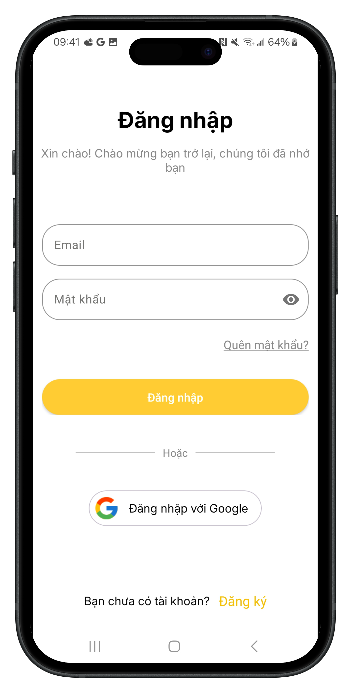
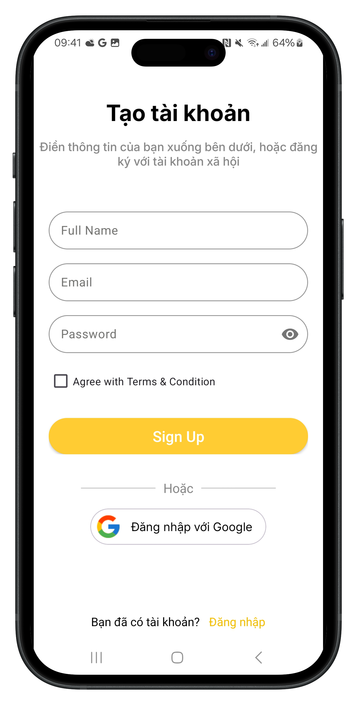
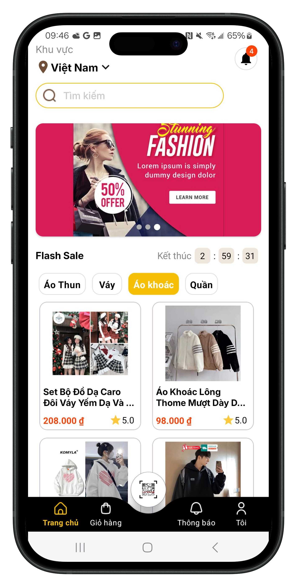
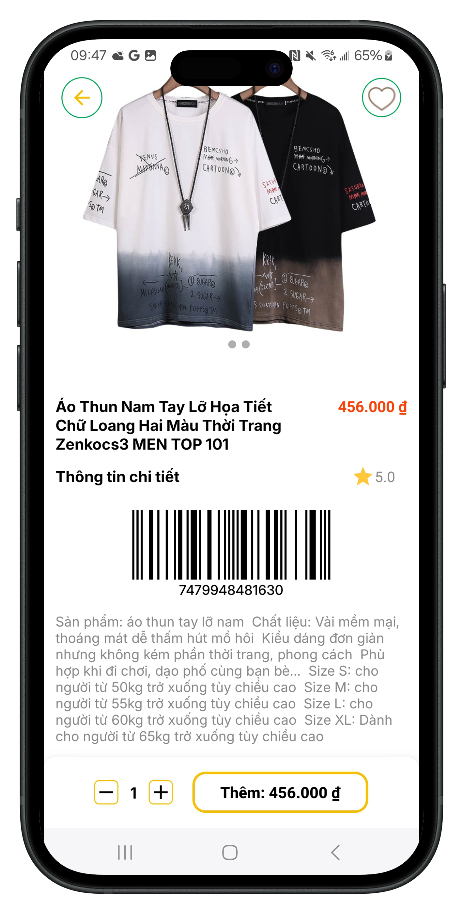
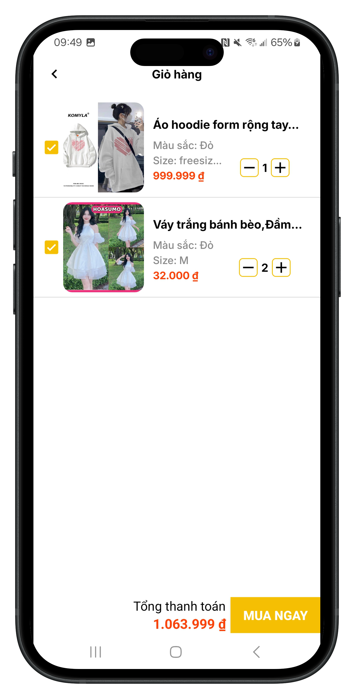
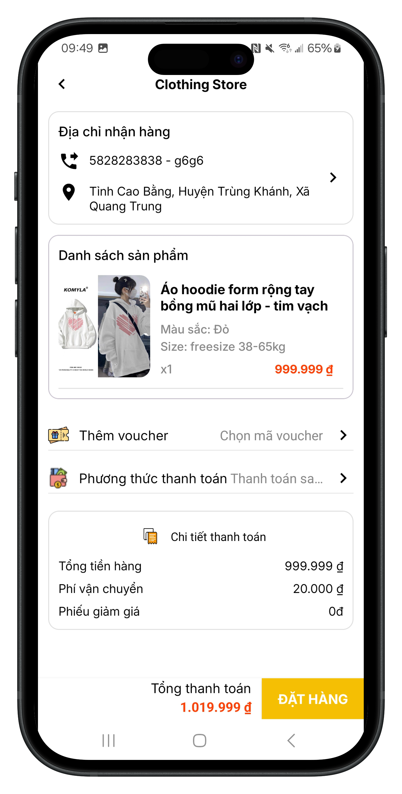
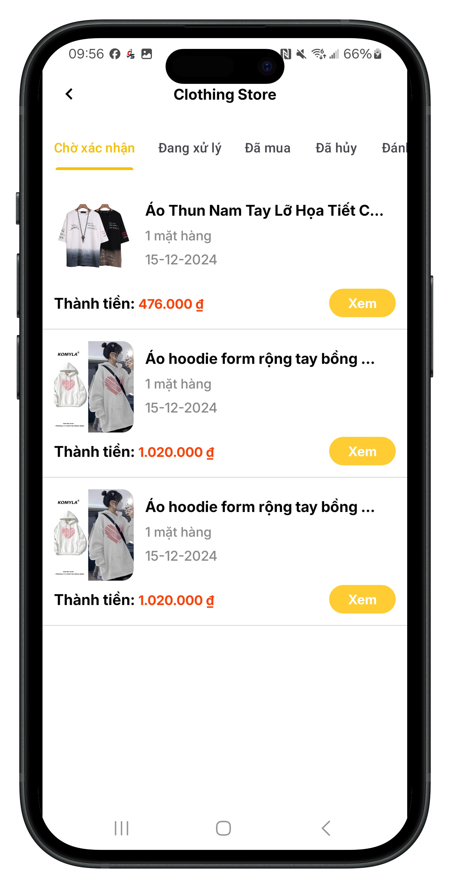
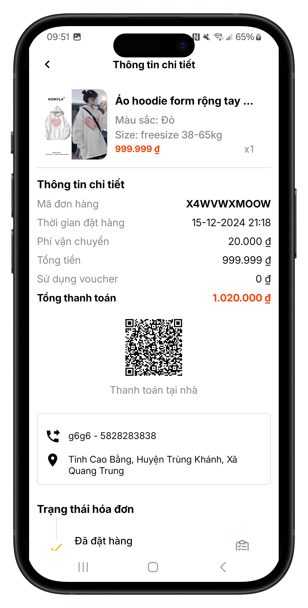
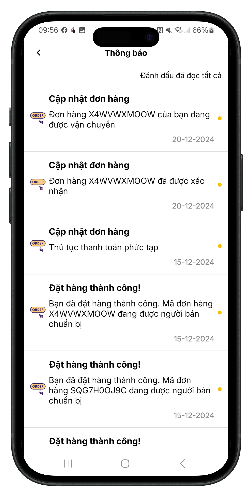
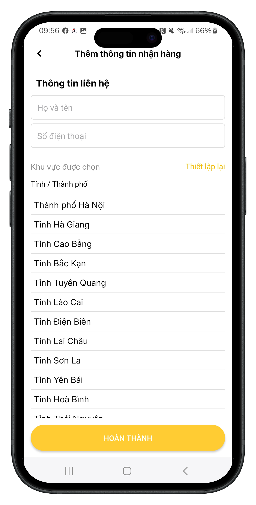

# Clothing Store
*Phần mềm thương mại điện tử*
>Hệ điều hành tối thiểu: >= Android 10

---

## Mô tả chung:
- Backend: NodeJs, Express, MySQL
- Mobile: Android Kotlin
- Sử dụng các dịch vụ thứ 3 như Firebase, Zalopay SDK
- Các chức năng được xây dựng tương tự với các nền tảng thương mại điện tử khác
- Xem sản phẩm, Thêm giỏ hàng, Mua hàng (Sử dụng voucher),Chat, Quản lý mua hàng, Quản lý thông tin cá nhân...

---

## Design: 
Link: [thiết kế giao diện](https://www.figma.com/file/aCTPI43xRXgEkn1yYFiOiM/Clothing-Store-App%2FFashion-E-Commerce-App-%7C-App%C2%A0UI%C2%A0Kit-(Community)?type=design&node-id=0-1&mode=design)

Demo: [video demo cơ bản app clothing store](https://drive.google.com/drive/u/0/folders/13maqqscSXbIU2neq34pLRcpyTMOOLZ1h)
## Giao diện Demo đã xây dựng

#### 1.Splash Screen

#### 2.Authentication

>Hiện tại người dùng có thể đăng nhập bằng tài khoản hệ thống hoặc thông qua google
>Trước khi đăng nhập vào hệ thống cần phải kiểm tra tài khoản đã được verify hay chưa?
>- Tên đăng nhập phải đúng định dạng là email
>- Mật khẩu [6,20] kí tự

***

>Người dùng có thể đăng ký bằng tài khoản email hoặc đăng ký nhanh thông qua dịch vụ của google
>Thông tin sẽ được lưu vào authentication - google của Firebase và lấy ra uid để làm ID duy nhất của khách hàng trong Firestore.
>Trước khi đăng ký(đăng nhập) nhanh bằng tài khoản google cần phải kiểm tra liệu email này đã tồn tại trong Firestore hay chưa. Tránh tình trạng mất mát dữ liệu cũ

***
#### 3.Home , Cart, Payment, Coupon, Method Payment

>Người dùng có thể xem chi tiết sản phẩm, size, màu sắc, hoặc thêm sản phẩm vào danh sách yêu thích
>Có thể xem thêm 1 số ảnh demo về sản phẩm nếu có
>Chọn số lượng và thêm vào giỏ hàng

***
>Trang giỏ hàng sẽ hiển thị tất cả sản phẩm đã được người dùng thêm vào giỏ hàng. Nếu không có sẽ hiển thị "chưa có sản phẩm nào trong giỏ hàng"
> Một số test:
>- Người dùng đã chọn sản phẩm bất kì sau đó sẽ tính và hiển thị tổng tiền
>- Sau khi chọn sản phẩm, người dùng thay đổi số lượng hay xóa sản phẩm đều được đảm bảo cập nhật lại danh sách sản phẩm đã chọn và số tiền tránh xảy ra sai sót  

***
>Khi mua hàng cần đảm bảo có thầy đủ thông tin nhận hàng
>Sử dụng voucher nếu có (voucher mà người dùng có thể sử dụng và chưa từng được sử dụng trước đây)
>Chọn phương thức thanh toán và xác nhận mua hàng

***
>View này sẽ hiển thị tất cả các mã giảm giá mà người dùng chưa sử dụng để áp dụng vào hóa đơn của mình
>=> Lấy tất cả voucher sau đó truy vấn collection "orders" kiểm tra nếu order đã sử dụng mã voucher với người dùng này thì sẽ không được thêm vào list, sau đó sẽ được kết quả là tất cả voucher mà người dùng chưa sử dụng để đảm bảo mỗi người chỉ được sử dụng một mã giảm giá duy nhất
>Người dùng có thể tìm kiếm voucher theo mã hoặc bấm sử dụng với các voucher đã hiển thị 

***

***

>Sử dụng skeleton để tạo hiệu ứng animations loading trong lúc lấy dữ liệu, đảm bảo trải nghiệm người dùng không bị quá cứng

***

# 4. Orders

>Phân trang lấy các hóa đơn tương ứng với từng trạng thái

***
>Track order sẽ sử dụng thời gian thực để đảm bảo dữ liệu được cập nhật chính xác nhất
>Ví dụ: khi người dùng vào track order cùng lúc đó admin cũng đang chuẩn bị xác nhận đơn hàng, sau khi xác nhận thì bên client sẽ được cập nhật luôn và nút hủy đơn hàng sẽ không còn hiển thị nữa.

***

5. Notification
>Thông báo các khuyến mãi, thông báo tình trạng hóa đơn cho người dùng

***

6. Address
>Chọn địa chỉ chính xác

***

# Xây dựng app:
*Nguyễn Văn Phúc*
*Email: nguyenvanphuc3603@gmail.com*
