# Clothing Store
*Phần mềm thương mại điện tử*
>Hệ điều hành tối thiểu: >= Android 10

---

##Mô tả:
- Phần mềm sử dụng API của firebase và các thư viện khác bên ngoài
- Các chức năng được xây dựng tương tự với các nền tảng thương mại điện tử khác
- Xem sản phẩm, Thêm giỏ hàng, Mua hàng (Sử dụng voucher),Chat, Xem lịch sử mua hàng, Quản lý thông tin cá nhân...

---

## Design: 
Link: [thiết kế giao diện](https://www.figma.com/file/aCTPI43xRXgEkn1yYFiOiM/Clothing-Store-App%2FFashion-E-Commerce-App-%7C-App%C2%A0UI%C2%A0Kit-(Community)?type=design&node-id=0-1&mode=design)

##Giao diện Demo đã xây dựng

#### 1.Splash Screen

---

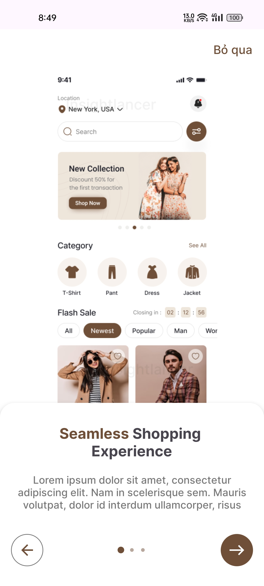

***

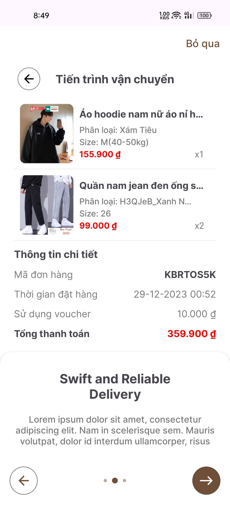

***

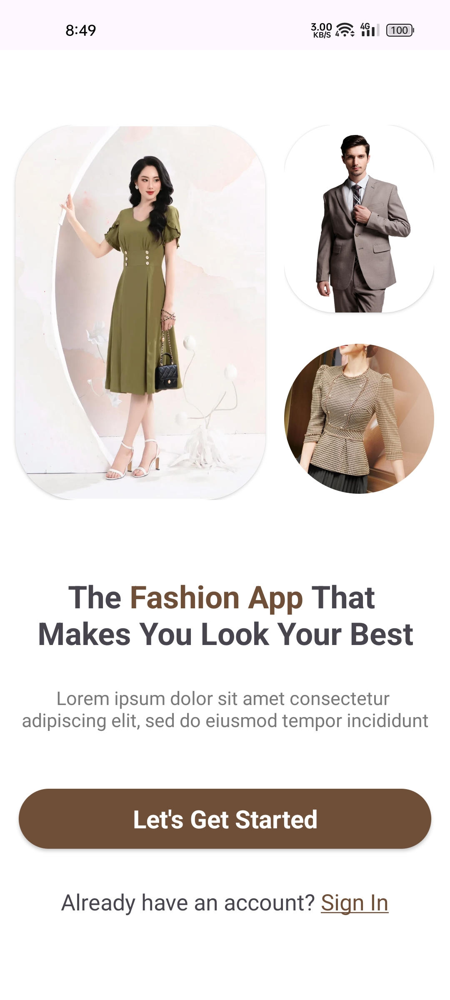

***

#### 2.Authentication

***

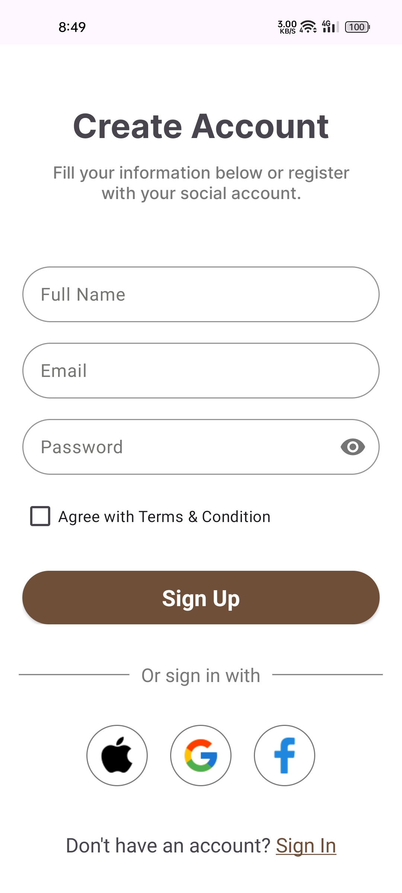

***
#### 3.Home , Cart, Payment, Coupon, Method Payment

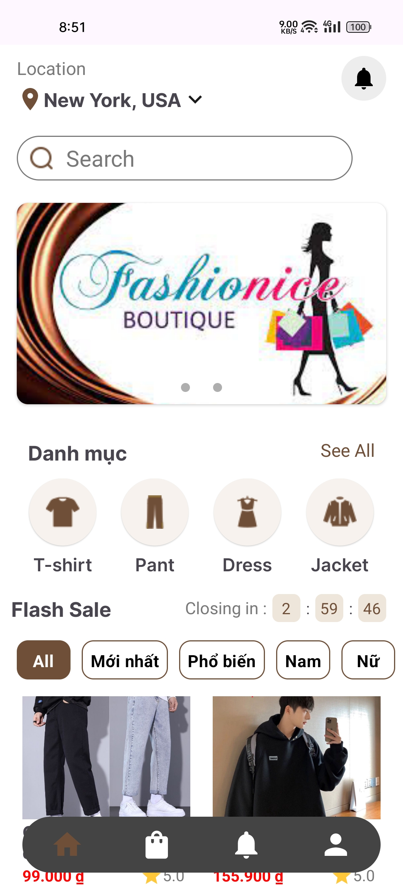

***

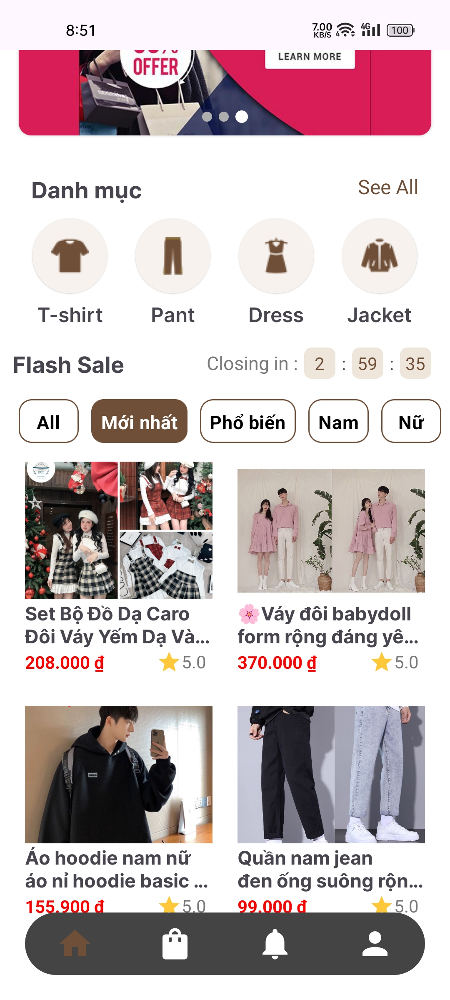

***

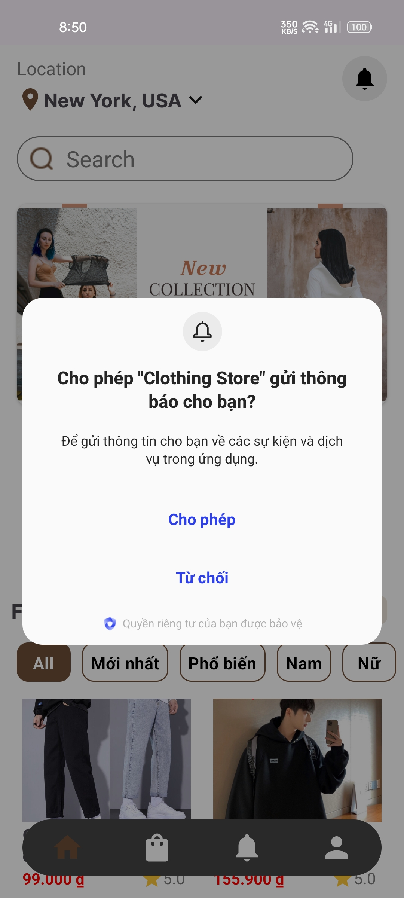

***

***

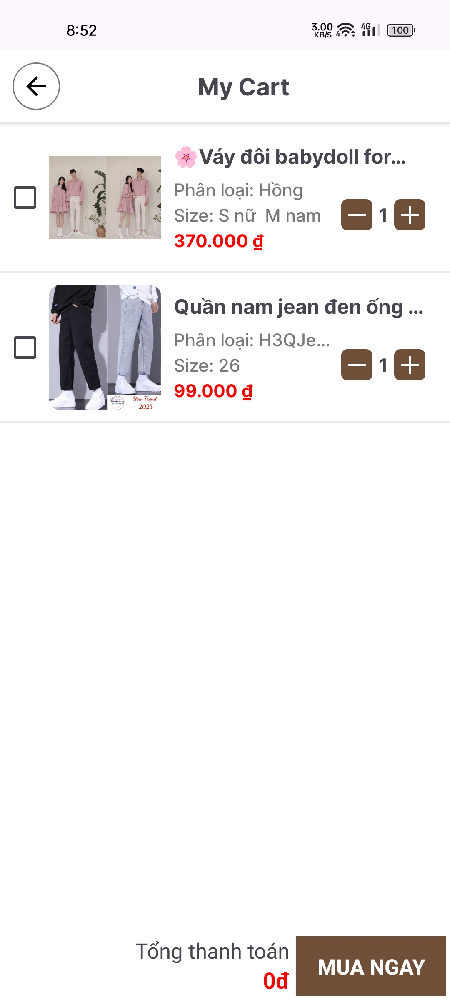

***

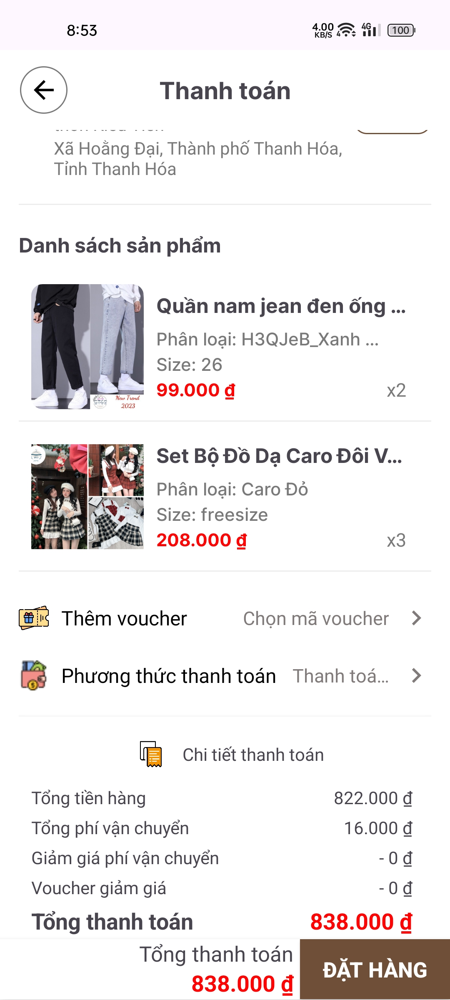

***

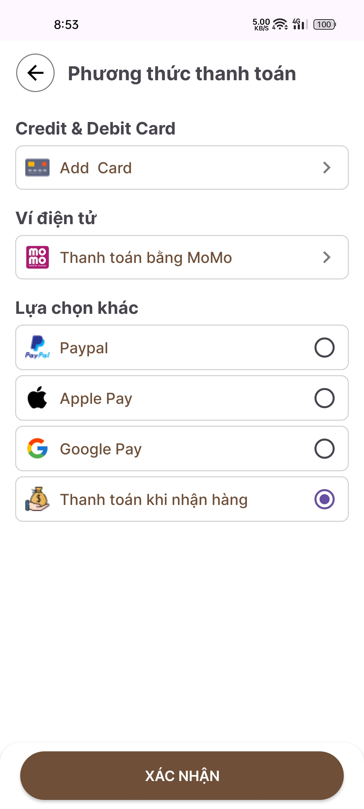

***

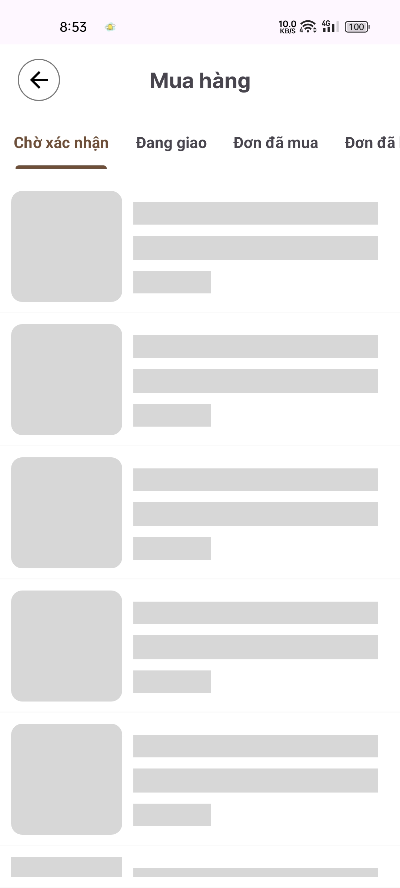

***

***

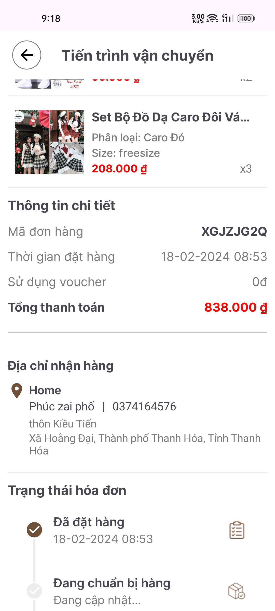

***

# Xây dựng app: Nguyễn Văn Phúc